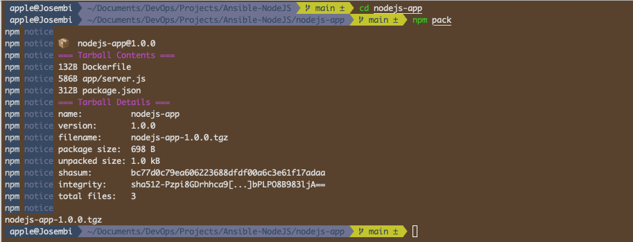
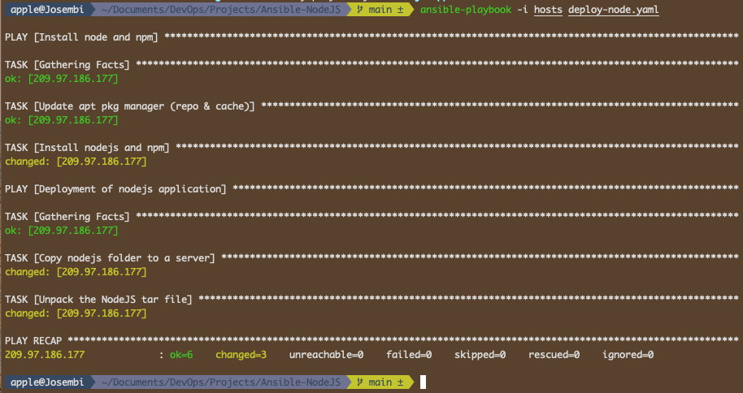
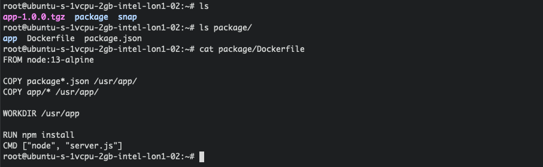
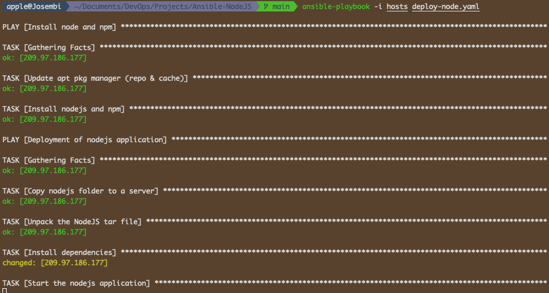
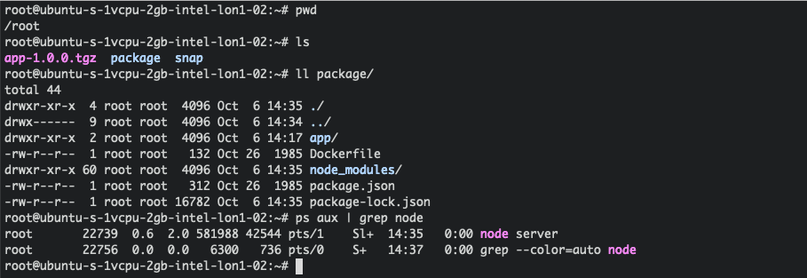
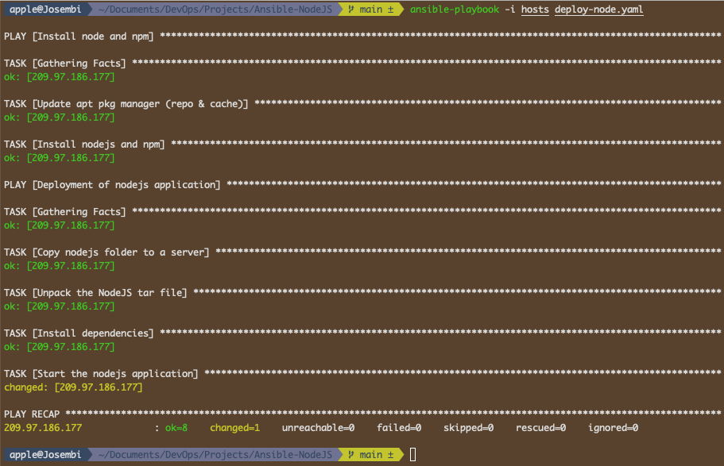
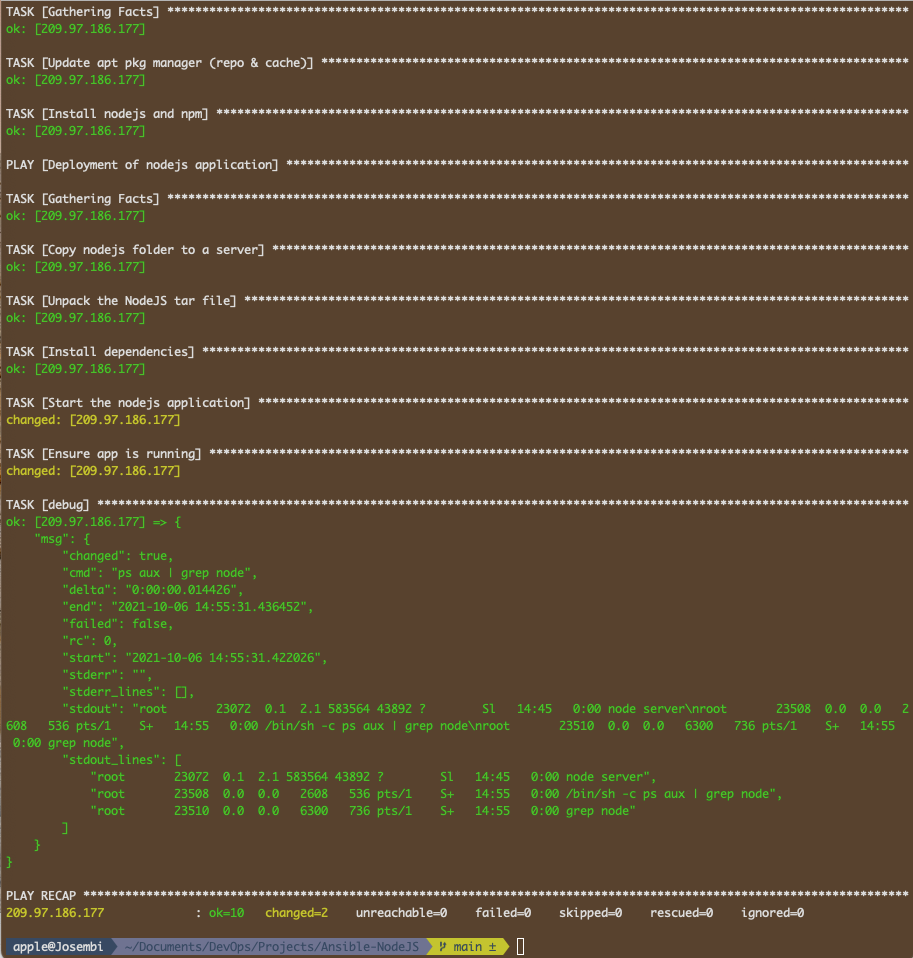

# Ansible NodeJS App Automation Deployment

<p float="left">
  
  
</p>

----

## Introduction

I will be automating the installation of a NodeJS application in a cloud server (Digital Ocean). This is what I want to achieve.

1. Create a Droplet on DigitalOcean
2. Write Ansible playbook
   * Install node & npm on server
   * Copy Node artifact and unpack
   * Start application
   * Verify App is running successfully

## Playbook 

### Installation and Deployment

I will write the playbook play for the installations of node, npm and their dependencies in the droplet. I will be aided by the documentation for instance when configuring the installation like [apt](https://docs.ansible.com/ansible/latest/collections/ansible/builtin/apt_module.html), etc.

```yaml
---
- name: Install node and npm
  hosts: 209.97.186.177
  tasks:
    - name: Update apt pkg manager (repo & cache)
      apt: update_cache=yes force_apt_get=yes cache_valid_time=3600
    - name: Install nodejs and npm
      apt:
        pkg:
          - nodejs
          - npm
```

The next play to write will be for the deployment of the app. I'll use an old project of nodeJS and package it to a tar file which when unpacked will give me the **package folder** that will house the *Dockerfile, app and package.json* files.



```yaml
- name: Deployment of nodejs application
  hosts: 209.97.186.177
  tasks:
    - name: Copy nodejs folder to a server
      copy:
        src: /Users/apple/Documents/DevOps/Projects/Ansible-NodeJS/nodejs-app/nodejs-app-1.0.0.tgz
        dest: /root/app-1.0.0.tgz
    - name: Unpack the NodeJS tar file
      unarchive:
        src: /root/app-1.0.0.tgz
        dest: /root/
        remote_src: yes
```

It took about 5 minutes and the deployment was successful.



If I SSH in the server I should see the unpacked NodeJS application.



### Starting Node App

In order to run the application, we need to do the following;

* Install App Dependencies
* Run node command

To achieve the above, I'll modify the configuration file by adding another play (**Install dependencies**) then run the playbook.

```yaml
- name: Deployment of nodejs application
  hosts: 209.97.186.177
  tasks:
    - name: Copy nodejs folder to a server
      copy:
        src: /Users/apple/Documents/DevOps/Projects/Ansible-NodeJS/nodejs-app/nodejs-app-1.0.0.tgz
        dest: /root/app-1.0.0.tgz
    - name: Unpack the NodeJS tar file
      unarchive:
        src: /root/app-1.0.0.tgz
        dest: /root/
        remote_src: yes
    - name: Install dependencies
      npm:
        path: /root/package
    - name: Start the nodejs application
      command:
        chdir: /root/package/app
        cmd: node server
```

Installation is successful but the server hangs when it comes to starting it.



</hr>



After pocking around, I realized that to solve the issue of the server hanging, I'll need to make the server run in the background by execute it asynchronously. After the modifications, I'll run again the ansible-playbook command which should be faster due to the idempotent nature of Ansible.



### Verify Node Server is Running

In order to make the verifications, shell injection comes in handy as it enables us to run the commands effectively. I'll append the following code to the previous one and run the playbook again.

```yaml
    - name: Verify app is running
      shell: ps aux | grep node
      register: app_status
    - debug: msg={{app_status}}
```



This command **ps aux | grep node** spits out the *msg* dictionary because I registered the **app_status** in a variable and the standard output lines (*stdout_lines*) are for debugging purposes.

## Superuser / Root

Following the principle of least privileges, I shouldn't have run this as a root (As an admin, I'm used to working this way). Each application should be tailored to a specific team-member or a group of users so that incase they break something, you won't have to rebuild the infrastructure or lose critical files.

To make sure that everything is secure I'll have to create a user with privileges to run the app and re-configure the playbook.