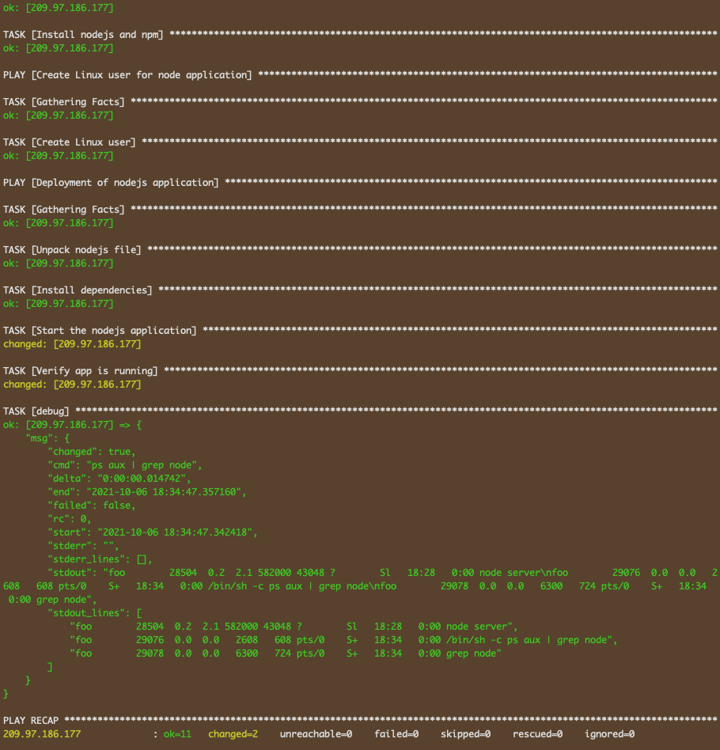

# Ansible NodeJS App Automation Deployment

<p float="left">
  
  
  
</p>

----

## Parameterize / Variables

It's possible to make playbooks configurable in order to use them in different environments and also reuse them in other projects. One way of doing this is by using variables and the other is by parameterizing. I will go ahead and parameterize the playbook. The second way which is not my favorite is to create variables and input them on the commandline when prompted as you execute the playbook, but I wont go down that road. 

```yaml
---
- name: Install node and npm
  hosts: 209.97.186.177
  tasks:
    - name: Update apt pkg manager (repo & cache)
      apt: update_cache=yes force_apt_get=yes cache_valid_time=3600
    - name: Install nodejs and npm
      apt:
        pkg:
          - nodejs
          - npm

- name: Create Linux user for node application
  hosts: 209.97.186.177
  tasks:
    - name: Create Linux user
      user:
        name: foo
        comment: Foo the developer
        group: admin

- name: Deployment of nodejs application
  hosts: 209.97.186.177
  become: True
  become_user: foo
  vars:
    - location: /Users/apple/Documents/DevOps/Projects/Ansible-NodeJS/nodejs-app/nodejs-app-1.0.0.tgz
    - destination: /home/foo
  tasks:
    - name: Unpack nodejs file
      unarchive:
        src: "{{location}}"
        dest: "{{destination}}"
    - name: Install dependencies
      npm:
        path: "{{destination}}/package"
    - name: Start the nodejs application
      command:
        chdir: "{{destination}}/package/app"
        cmd: node server
      async: 1000
      poll: 0
    - name: Verify app is running
      shell: ps aux | grep node
      register: app_status
    - debug: msg={{app_status}}
```

Ofcourse everything parses as anticipated.



The last method is applicable for large playbooks where an external variable file is created.
The variable file can take any name and it uses key-value pairs similar to YAML files. In my case I've created the file **variables** and to reference it to the yaml file you add it as follows;

```yaml
vars_files:
    - variables
```
