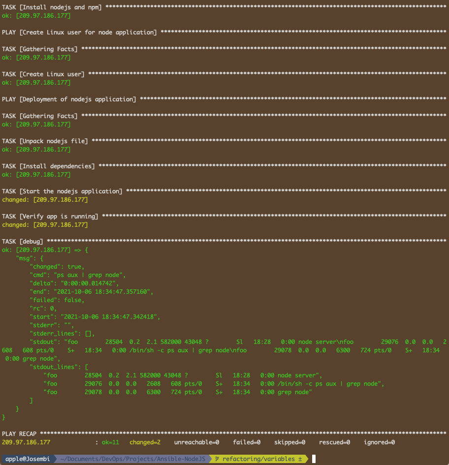

# Ansible NodeJS App Automation Deployment

<p float="left">
  
  
</p>

----

## Introduction

I will be automating the deployment of a NodeJS application in a cloud server (Digital Ocean). The following is what I want to achieve.

1. Create a Droplet on DigitalOcean
2. Write Ansible playbook
   * Install node & npm on server
   * Copy Node artifact and unpack
   * Start application
   * Verify App is running successfully

## Playbook

### Installation and Deployment

I will write the playbook for the installations of node, npm and their dependencies. I will be aided by the documentation like for instance in this case of configuring the installation using [apt](https://docs.ansible.com/ansible/latest/collections/ansible/builtin/apt_module.html) package manager.

```yaml
---
- name: Install node and npm
  hosts: 209.97.186.177
  tasks:
    - name: Update apt pkg manager (repo & cache)
      apt: update_cache=yes force_apt_get=yes cache_valid_time=3600
    - name: Install nodejs and npm
      apt:
        pkg:
          - nodejs
          - npm
```

The next play to write will be for the deployment of the app. I'll use an old project of nodeJS and package it to a tar file which when unpacked will give me the **package folder** that will house the *Dockerfile, app and package.json* files.


```yaml
- name: Deployment of nodejs application
  hosts: 209.97.186.177
  tasks:
    - name: Copy nodejs folder to a server
      copy:
        src: /Users/apple/Documents/DevOps/Projects/Ansible-NodeJS/nodejs-app/nodejs-app-1.0.0.tgz
        dest: /root/app-1.0.0.tgz
    - name: Unpack the NodeJS tar file
      unarchive:
        src: /root/app-1.0.0.tgz
        dest: /root/
        remote_src: yes
```

It took about 5 minutes and the deployment was successful.


If I SSH in the server I should see the unpacked NodeJS application.


### Starting Node App

In order to run the application, we need to do the following;

* Install App Dependencies
* Run node command

To achieve the above, I'll modify the configuration file as follows then run the playbook.

```yaml
- name: Deployment of nodejs application
  hosts: 209.97.186.177
  tasks:
    - name: Copy nodejs folder to a server
      copy:
        src: /Users/apple/Documents/DevOps/Projects/Ansible-NodeJS/nodejs-app/nodejs-app-1.0.0.tgz
        dest: /root/app-1.0.0.tgz
    - name: Unpack the NodeJS tar file
      unarchive:
        src: /root/app-1.0.0.tgz
        dest: /root/
        remote_src: yes
    - name: Install dependencies
      npm:
        path: /root/package
    - name: Start the nodejs application
      command:
        chdir: /root/package/app
        cmd: node server
```

Installation is successful but the server hangs instead of starting.


</hr>


After pocking around, I realized that to solve the issue, I'll need to make the server run in the background by executing it asynchronously. After the modifications, I'll run again the ansible-playbook command which should be faster this time due to the idempotent nature of Ansible.


### Verify Node Server is Running

In order to make the verifications, shell injection comes in handy as it enables us to run the commands effectively. I'll append the following code to the previous one and run the playbook again.

```yaml
    - name: Verify app is running
      shell: ps aux | grep node
      register: app_status
    - debug: msg={{app_status}}
```


This command **ps aux | grep node** spits out the *msg* dictionary because I registered the **app_status** in a variable and the standard output lines (*stdout_lines*) are for debugging purposes.

## Superuser / Root

Following the principle of least privileges, I shouldn't have run this as root (as an admin, I'm used to working this way and I rarely use sudo unless testing). Anyway, each application should be tailored to a specific team-member or a group of users so that incase they break something, you won't have to rebuild the infrastructure or lose critical files. 

By the way, with privileges (admin/root/Superuser) come great responsibilities. Always document everything, even if it seems trivial like a request to give temporary permissions to an intern. Large companies have very efficient ticketing systems which can track down not only who but the date and time a request was made, whether training was successful and what level of privileges were given.

To make sure that everything is secure I'll have to create a user (**foo**) with minimum privileges to run the app. I'll re-configure the playbook as follows. Even though I'm connecting as root (See **hosts** file), I will install node, npm and create the user as **root**, then the user **foo** will deploy the application.

```yaml
---
- name: Install node and npm
  hosts: 209.97.186.177
  tasks:
    - name: Update apt pkg manager (repo & cache)
      apt: update_cache=yes force_apt_get=yes cache_valid_time=3600
    - name: Install nodejs and npm
      apt:
        pkg:
          - nodejs
          - npm

- name: Create Linux user for node application
  hosts: 209.97.186.177
  tasks:
    - name: Create Linux user
      user:
        name: foo
        comment: Foo the developer
        group: admin
      register: user_creation_result
    - debug: msg={{user_creation_result.uid}}

- name: Deployment of nodejs application
  hosts: 209.97.186.177
  become: True
  become_user: foo
  tasks:
    - name: Unpack nodejs file
      unarchive:
        src: /Users/apple/Documents/DevOps/Projects/Ansible-NodeJS/nodejs-app/nodejs-app-1.0.0.tgz
        dest: /home/foo
      register: user_creation_result
    - debug: msg={{user_creation_result}}

    - name: Install dependencies
      npm:
        path: /home/foo/package
    - name: Start the nodejs application
      command:
        chdir: /home/foo/package/app
        cmd: node server
      async: 1000
      poll: 0
    - name: Verify app is running
      shell: ps aux | grep node
      register: app_status
    - debug: msg={{app_status.stdout_lines}}
```



## Parameterize / Variables